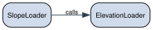

Running a pipeline and understanding the cache
==============================================

This example walks through a two-loader pipeline — ``ElevationLoader`` →
``SlopeLoader`` — from first run to cache hit to invalidation. The goal
is to make the hash chain concrete: what goes into each hash, what file
lands where, and exactly what triggers a recompute.

Setup
-----

In a real project you configure the cache and registry paths once and
define a ``SPEC`` that is fixed for the whole project. Changing ``SPEC``
invalidates every cached output because the spec is folded into the
state hash.

.. code:: python

   import pygeodata as pgd
   from pygeodata.types import SpatialSpec
   from pyproj import CRS

   pgd.get_config().update(
       path_cache='data_processed',
       path_registry='.source',
   )

   SPEC = SpatialSpec(
       crs=CRS.from_epsg(3035),
       transform=pgd.SpatialSpec.from_raster_file('reference.tif').transform,
       shape=(4400, 6600),
   )

Loader definitions
------------------

Loaders must live in importable modules — pygeodata reads their source
code via ``inspect.getsource`` for cache invalidation. Defining them
inline in a script or notebook would produce unstable source hashes.

``SlopeLoader`` holds a reference to ``ElevationLoader`` as a
constructor parameter. This is the *data-as-parameters* pattern: the
dependency is explicit, typed, and part of the hash.

.. code:: ipython3

    # loaders/dem.py — importable module
    import sys, os
    sys.path.insert(0, os.path.dirname(os.path.abspath('__file__')))
    
    from loaders.dem import ElevationLoader, SlopeLoader
    
    print(ElevationLoader())
    print(SlopeLoader())

.. parsed-literal::

    ElevationLoader(src='data/srtm_30m.tif')
    SlopeLoader(elevation=ElevationLoader(src='data/srtm_30m.tif'))

The loader source for reference:

.. code:: python

   # loaders/dem.py
   from dataclasses import dataclass

   import numpy as np
   from pygeodata.api import load
   from pygeodata.data import Data
   from pygeodata.drivers.rioxarray import RioXArrayDriver
   from pygeodata.processors.reprojection import Reprojector
   from pygeodata.types import SpatialSpec
   from rasterio.enums import Resampling

   @dataclass
   class ElevationLoader(Data):
       """Reproject the source DEM to the target spec."""

       src: str = 'data/srtm_30m.tif'

       @property
       def processor(self):
           return Reprojector(src_path=self.src, resampling=Resampling.bilinear, dst_dtype=np.float32)

   @dataclass
   class SlopeLoader(Data):
       """Terrain slope derived from ElevationLoader, in degrees."""

       elevation: ElevationLoader = None

       ext = 'tif'
       driver = RioXArrayDriver()

       def __post_init__(self):
           if self.elevation is None:
               self.elevation = ElevationLoader()

       def _process(self, spec: SpatialSpec) -> None:
           import xrspatial
           dem = load(self.elevation, spec)
           slope = xrspatial.slope(dem)
           slope.rio.to_raster(self.get_processed_path(spec))

First run
---------

.. code:: python

   pgd.process(SlopeLoader(), SPEC)

What happens:

1. ``SlopeLoader.process(SPEC)`` calls ``is_processed(SPEC)``. The hash
   file does not exist yet, so this returns ``False``.
2. ``SlopeLoader._process(SPEC)`` calls ``load(self.elevation, SPEC)``.
   ``load`` calls ``ElevationLoader.process(SPEC)`` first — same cache
   check, same miss, so the DEM reprojection runs.
3. ``ElevationLoader.write_cache_metadata(SPEC)`` writes its hash file.
4. Back in ``SlopeLoader._process``, the slope raster is computed and
   written.
5. ``SlopeLoader.write_cache_metadata(SPEC)`` writes its hash file.
6. Both classes call ``update_registry()``, which writes their source
   code and dependency tree snapshot to ``.source/``.

What lands on disk
------------------

::

   data_processed/
   └── <slope_state_hash>/            ← SHA-256 of (instance_hash, spec)
       ├── slope_loader.tif           ← the output raster
       ├── .slope_loader.hash.json    ← written by write_cache_metadata()
       ├── .slope_loader.params.json  ← serialised constructor parameters
       └── .slope_loader.spec.json    ← the SpatialSpec used

   .source/
   ├── code/
   │   ├── <elevation_source_hash>/
   │   │   ├── source.py              ← ElevationLoader class body (verbatim)
   │   │   └── source.json            ← {class_name, source_hash, registered_at, …}
   │   └── <slope_source_hash>/
   │       ├── source.py
   │       └── source.json
   └── snapshots/
       └── <slope_dep_tree_hash>/
           ├── tree.json              ← {nodes, tree} dependency topology
           └── graph.pdf              ← rendered class dependency graph

Each directory under ``data_processed/`` is named by the **state hash**
— a SHA-256 that binds together the instance hash and the spec. Two runs
on different specs for the same loader land in different directories and
never interfere.

The ``.hash.json`` file
-----------------------

After processing, each output directory contains a sidecar
``.slope_loader.hash.json``:

.. code:: json

   {
       "format_version": 1,
       "class_name": "SlopeLoader",
       "object_type": "Data",
       "source_hash": "a3f8…",
       "dependency_tree_hash": "7c11…",
       "instance_hash": "b902…",
       "state_hash": "d45e…",
       "co_outputs": []
   }

The fields and what changes them:

**``source_hash``** — SHA-256 of the AST of ``SlopeLoader`` alone — its
own class body, nothing else. Whitespace and docstring changes that do
not affect the AST do not change this hash.

**``dependency_tree_hash``** — SHA-256 of the entire dependency tree
rooted at ``SlopeLoader``. This includes the source hashes of
``ElevationLoader`` and every other transitively reachable class.
Changing ``ElevationLoader``\ ’s code changes this hash even if
``SlopeLoader`` is untouched.

**``instance_hash``** — SHA-256 of ``{dependency_tree_hash, params}``.
Two ``SlopeLoader`` instances with different ``elevation`` values have
different instance hashes. Spec-independent.

**``state_hash``** — SHA-256 of ``{instance_hash, spec}``. This is the
directory name under ``data_processed/``. It is unique per (loader
instance, spec) pair.

**``co_outputs``** — State hashes of sibling artifacts produced in the
same ``_process`` call (the co-output pattern). Empty here; see the
custom processing tutorial for an example.

Second run — cache hit
----------------------

.. code:: python

   pgd.process(SlopeLoader(), SPEC)   # no-op

``is_processed(SPEC)`` reads ``.slope_loader.hash.json``, computes the
live state hash, and finds them equal. ``_process`` is never called.

The dependency graph
--------------------

The class-level graph is built by static AST analysis: pygeodata walks
the class body of each registered ``TrackedObject``, finds references to
other registered classes, and records them as call edges. No data files
are needed to generate it.

.. code:: ipython3

    import os, tempfile
    from pygeodata.graphs import plot_class_dependency_graph
    from IPython.display import SVG, display
    
    graph_data = SlopeLoader.get_dependency_graph()
    
    with tempfile.TemporaryDirectory() as tmp:
        path = os.path.join(tmp, 'graph_slope.svg')
        plot_class_dependency_graph(
            cls_name='SlopeLoader',
            graph_data=graph_data,
            path=path,
        )
        display(SVG(path))

Arrows point from dependent to dependency (``SlopeLoader`` →
``ElevationLoader``). The graph is stored at
``.source/snapshots/<dep_tree_hash>/graph.pdf`` and written once per
unique dependency tree hash. Viewing it in the registry browser’s Code
tab shows which version of the dependency tree was active when any
particular output was produced.

Cache invalidation
------------------

Scenario 1: change a parameter
~~~~~~~~~~~~~~~~~~~~~~~~~~~~~~

Change the default source path in ``ElevationLoader``:

.. code:: python

   @dataclass
   class ElevationLoader(Data):
       src: str = 'data/copernicus_dem_30m.tif'   # was: srtm_30m.tif
       ...

The class body changed. On the next ``process(SlopeLoader(), SPEC)``
call:

1. ``calculate_cls_source_hash(ElevationLoader)`` produces a new hash.
2. ``SlopeLoader.get_dependency_tree_hash()`` recomputes — it includes
   ``ElevationLoader``\ ’s source hash — and also changes.
3. ``SlopeLoader.get_instance_hash()`` changes (depends on
   dep_tree_hash).
4. ``SlopeLoader.get_state_hash(SPEC)`` changes (depends on
   instance_hash).
5. ``is_processed(SPEC)`` reads the old state hash from disk, compares
   it to the new live hash, and returns ``False``.
6. Both loaders recompute.

The old output remains on disk under its old state hash directory. It
will be cleaned up by ``clean_cache()``.

Scenario 2: change a constructor argument
~~~~~~~~~~~~~~~~~~~~~~~~~~~~~~~~~~~~~~~~~

.. code:: python

   # default: SlopeLoader(elevation=ElevationLoader(src='data/srtm_30m.tif'))
   pgd.process(SlopeLoader(elevation=ElevationLoader(src='data/eu_dem.tif')), SPEC)

The ``params`` dict of the outer ``SlopeLoader`` instance changes
because it contains a reference to a different ``ElevationLoader``
instance (whose own instance hash is different). The state hash changes,
a new directory is created, and the old one is untouched. You now have
two cached versions of the slope raster simultaneously — one per
elevation source.

Scenario 3: edit the ``SlopeLoader`` class body
~~~~~~~~~~~~~~~~~~~~~~~~~~~~~~~~~~~~~~~~~~~~~~~

Add a ``smooth`` parameter:

.. code:: python

   @dataclass
   class SlopeLoader(Data):
       elevation: ElevationLoader = None
       smooth: int = 0              # new parameter

       def _process(self, spec: SpatialSpec) -> None:
           import xrspatial
           dem = load(self.elevation, spec)
           slope = xrspatial.slope(dem)
           if self.smooth:
               slope = slope.rolling(x=self.smooth, y=self.smooth,
                                     center=True).mean()
           slope.rio.to_raster(self.get_processed_path(spec))

``SlopeLoader``\ ’s own ``source_hash`` changes. Its
``dependency_tree_hash`` changes. Its ``instance_hash`` changes (because
``smooth=0`` is now in the params dict). The state hash changes. Cache
miss, recompute.

Note that ``ElevationLoader`` is unaffected — its own cache entry is
still valid. Only ``SlopeLoader``\ ’s output is recomputed.
