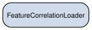
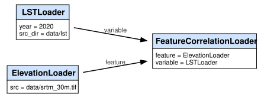

Passing Data instances as parameters
====================================

Loaders are plain Python objects. They can be passed as constructor
arguments to other loaders, stored in lists, swapped at runtime. This
page shows what that means for hashing, cache invalidation, and the
dependency graph.

The pattern
-----------

Consider a loader that computes the pixel-wise correlation between two
geospatial variables. The natural signature is:

.. code:: python

   # loaders/correlation.py
   from dataclasses import dataclass

   import numpy as np
   from pygeodata.api import load
   from pygeodata.data import Data
   from pygeodata.drivers.rioxarray import RioXArrayDriver
   from pygeodata.types import SpatialSpec

   @dataclass
   class FeatureCorrelationLoader(Data):
       """
       Pearson correlation between two spatial variables at each pixel over time.

       Both ``feature`` and ``variable`` are Data instances — they are computed
       (or loaded from cache) at runtime and their hashes are part of this
       loader's cache key.
       """

       feature: Data = None
       variable: Data = None

       ext = 'tif'
       driver = RioXArrayDriver()

       def _process(self, spec: SpatialSpec) -> None:
           x = load(self.feature, spec)
           y = load(self.variable, spec)
           corr = np.corrcoef(x.values.ravel(), y.values.ravel())[0, 1]
           import xarray as xr
           out = xr.full_like(x, fill_value=float(corr))
           out.rio.to_raster(self.get_processed_path(spec))

``feature`` and ``variable`` have type ``Data``, not ``ElevationLoader``
or any specific subclass. Any loader can be wired in.

.. code:: ipython3

    import sys, os
    sys.path.insert(0, os.path.dirname(os.path.abspath('__file__')))
    
    from loaders.dem import ElevationLoader, SlopeLoader
    from loaders.climate import LSTLoader, NDVILoader
    from loaders.correlation import FeatureCorrelationLoader

How the instance hash is computed
---------------------------------

When pygeodata computes
``FeatureCorrelationLoader.get_instance_hash()``, it serialises the
``params`` dict before hashing:

.. code:: python

   state = {
       'dependency_tree_hash': cls.get_dependency_tree_hash(),
       'params': {k: format_json(v) for k, v in self.get_params().items()},
   }

``format_json`` recurses into ``Data`` instances and replaces them with
their ``instance_hash``. So the effective params dict for

.. code:: python

   FeatureCorrelationLoader(
       feature=ElevationLoader(src='data/srtm_30m.tif'),
       variable=LSTLoader(year=2020),
   )

looks like:

.. code:: json

   {
       "feature":   {"class_name": "ElevationLoader", "instance_hash": "a3f8…"},
       "variable":  {"class_name": "LSTLoader",       "instance_hash": "c72d…"}
   }

Swapping either parameter produces a different instance hash, a
different state hash, and a different output directory.

.. code:: ipython3

    loader_a = FeatureCorrelationLoader(
        feature=ElevationLoader(),
        variable=LSTLoader(year=2020),
    )
    loader_b = FeatureCorrelationLoader(
        feature=ElevationLoader(),
        variable=LSTLoader(year=2021),
    )
    
    print('loader_a instance hash:', loader_a.get_instance_hash())
    print('loader_b instance hash:', loader_b.get_instance_hash())
    print('hashes differ:', loader_a.get_instance_hash() != loader_b.get_instance_hash())

.. parsed-literal::

    loader_a instance hash: 8bc8e091ecec52bd25b2254be843d7ab8fe2fe539072d057e6f7463da753eb9f
    loader_b instance hash: 906de457dd77e25c30e227ba8961a1222a5e9f614f9118b3c2affeb0eda073ed
    hashes differ: True

Changing a dependency invalidates downstream caches
---------------------------------------------------

Suppose ``ElevationLoader`` is edited — say, the reprojection resampling
algorithm is changed from ``bilinear`` to ``nearest``:

.. code:: python

   @dataclass
   class ElevationLoader(Data):
       src: str = 'data/srtm_30m.tif'

       @property
       def processor(self):
           return Reprojector(src_path=self.src, resampling=Resampling.nearest)  # changed

The hash chain unwinds from the bottom:

1. ``calculate_cls_source_hash(ElevationLoader)`` → new hash.
2. ``ElevationLoader.get_dependency_tree_hash()`` → new hash.
3. ``ElevationLoader.get_instance_hash()`` → new hash.
4. ``FeatureCorrelationLoader.get_dependency_tree_hash()`` includes the
   source hash of every reachable class, including ``ElevationLoader`` →
   new hash.
5. ``FeatureCorrelationLoader.get_instance_hash()`` → new hash
   (dep_tree_hash changed, and the ``feature`` param’s ``instance_hash``
   changed).
6. ``FeatureCorrelationLoader.get_state_hash(spec)`` → new hash.
7. Cache miss for ``FeatureCorrelationLoader``. Recompute.

``ElevationLoader`` also recomputes. Any other loader that lists
``ElevationLoader`` as a call dependency — detected by AST analysis of
its class body — will also have a stale ``dependency_tree_hash`` and
will recompute.

Running multiple configurations simultaneously
----------------------------------------------

Because the state hash incorporates the full parameter tree, you can
process multiple configurations in a single script without them
interfering:

.. code:: python

   import pygeodata as pgd

   pgd.get_config().update(path_cache='data_processed')
   spec = pgd.SpatialSpec.from_raster_file('reference.tif')

   configs = [
       FeatureCorrelationLoader(feature=ElevationLoader(), variable=LSTLoader(year=2020)),
       FeatureCorrelationLoader(feature=ElevationLoader(), variable=LSTLoader(year=2021)),
       FeatureCorrelationLoader(feature=NDVILoader(),      variable=LSTLoader(year=2020)),
   ]

   for loader in configs:
       pgd.process(loader, spec)

Each produces a separate directory under ``data_processed/``. Re-running
the script is a no-op for whichever configurations are still valid.

The class dependency graph
--------------------------

The class-level graph shows which *classes* can depend on which other
classes, as discovered by static AST analysis.

.. code:: ipython3

    import os, tempfile
    from pygeodata.graphs import plot_class_dependency_graph
    from IPython.display import SVG, display
    
    graph_data = FeatureCorrelationLoader.get_dependency_graph()
    
    with tempfile.TemporaryDirectory() as tmp:
        path = os.path.join(tmp, 'graph_feature_correlation.svg')
        plot_class_dependency_graph(
            cls_name='FeatureCorrelationLoader',
            graph_data=graph_data,
            path=path,
        )
        display(SVG(path))

The runtime execution graph
---------------------------

The class-level graph shows which *classes* can depend on which other
classes. At runtime, after a ``process()`` call that involves loaders
passed as parameters, pygeodata also builds a per-instance graph that
shows the actual wiring for that specific run — which instance of
``ElevationLoader`` was used, with what parameters.

This graph is generated by ``Artifact.get_runtime_dependency_graph()``,
which walks ``get_params()`` recursively and collects param edges
between instances. It is only written when at least one constructor
parameter is itself a ``TrackedObject``.

.. code:: ipython3

    from affine import Affine
    from pyproj import CRS
    from pygeodata.graphs import plot_compact_execution_graph
    from pygeodata.types import SpatialSpec
    
    spec = SpatialSpec(
        crs=CRS.from_epsg(3035),
        transform=Affine(1000, 0, 3000000, 0, -1000, 4000000),
        shape=(100, 100),
    )
    
    loader = FeatureCorrelationLoader(
        feature=ElevationLoader(src='data/srtm_30m.tif'),
        variable=LSTLoader(year=2020),
    )
    
    graph_data = loader.get_runtime_dependency_graph(spec)
    
    with tempfile.TemporaryDirectory() as tmp:
        path = os.path.join(tmp, 'graph_runtime.svg')
        plot_compact_execution_graph(
            graph_data=graph_data,
            root_id=loader.get_instance_hash(),
            path=path,
        )
        display(SVG(path))

Each node is labelled with its class name and parameter values. The
graph is also written to disk at
``data_processed/<state_hash>/.feature_correlation_loader.graph.pdf``
after a real ``process()`` call.

Choosing what to parameterise
-----------------------------

Not every dependency needs to be a constructor parameter. The two
patterns have different trade-offs.

**Hardcoded dependency** (call dependency detected by AST):

.. code:: python

   class SlopeLoader(Data):
       def _process(self, spec):
           dem = load(ElevationLoader(), spec)
           ...

``SlopeLoader`` always uses ``ElevationLoader``. No flexibility, but the
relationship is visible in the class-level dependency graph and is
captured in the dependency tree hash. Changing ``ElevationLoader`` still
invalidates ``SlopeLoader``.

**Constructor parameter** (data-as-parameters):

.. code:: python

   @dataclass
   class FeatureCorrelationLoader(Data):
       feature: Data
       variable: Data

Any ``Data`` instance can be wired in. The instance hash changes when
either input changes, whether because the input’s code changed or
because a different instance was passed. Use this when the loader is
genuinely generic — it should work for any feature or variable, and the
choice belongs to the caller.
