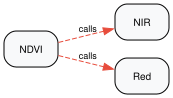
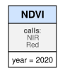
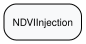
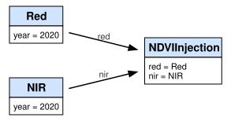

None

.. note:: This tutorial was generated from an IPython notebook that can be
          downloaded `here <../../../source/notebooks/02_building_a_pipeline.ipynb>`_.

.. _02_building_a_pipeline:

Building a Multi-Step Pipeline
==============================

Chain ``DataLoader``\ s so downstream loaders depend on upstream ones,
forming a DAG that ``pygeodata`` manages automatically. If an upstream
loader’s code or parameters change, all downstream caches are
automatically invalidated.

.. code:: python

    import os
    os.chdir("../../..")

.. code:: python

    from dataclasses import dataclass
    from pathlib import Path
    import numpy as np
    
    from pygeodata import DataLoader, SpatialSpec, load, set_config
    from pygeodata.visualisations import plot_compact_execution_graph, plot_class_dependency_graph
    from pyproj import CRS
    from affine import Affine
    import json
    
    set_config(path_data_processed=Path("./data/processed"))
    
    spec = SpatialSpec(
        crs=CRS.from_epsg(4326),
        transform=Affine(0.25, 0, -180, 0, -0.25, 90),
        shape=(720, 1440),
    )

Defining loaders for NDVI
-------------------------

These loaders do not store anything, they just overwrite load to
represent the parameters. In this example we calculate NDVI values based
on red and near infrared bands. Red and NIR are defined as follows:

.. code:: python

    # @dataclass
    # class Red(DataLoader):
    #     year: int
    
    #     def _process(self, spec) -> None:
    #         return
    
    #     def load(self, spec):
    #         return 0.05
    
    #     driver = RioXArrayDriver()
    
    
    # @dataclass
    # class NIR(DataLoader):
    #     year: int
    
    #     def _process(self, spec) -> None:
    #         return
    
    #     def load(self, spec):
    #         return 0.5
    
    #     driver = RioXArrayDriver()

NDVI can then ben defined in two ways. One by calling the Red and NIR
objects in it’s body, the other by injecting these objects as
parameters. The latter is conceptually more powerful, but can be
overkill in simple chains.

.. code:: python

    # @dataclass
    # class NDVI(DataLoader):
    #     year: int
    
    #     def _process(self, spec) -> None:
    #         return
    
    #     def load(self, spec):
    #         red = load(Red(year=self.year), spec)
    #         nir = load(NIR(year=self.year), spec)
    #         return (nir - red) / (nir + red)
    
    #     driver = RioXArrayDriver()
    
    # @dataclass
    # class NDVIInjection(DataLoader):
    #     red: Red
    #     nir: NIR
    
    #     def _process(self, spec) -> None:
    #         return
    
    #     def load(self, spec):
    #         red = load(self.red, spec)
    #         nir = load(self.nir, spec)
    #         return (nir - red) / (nir + red)
    
    #     driver = RioXArrayDriver()

.. code:: python

    from utils.docs_loaders import NDVI, Red, NIR, NDVIInjection
    
    ndvi = NDVI(2020)
    
    red = Red(2020)
    nir = NIR(2020)
    ndvi_2 = NDVIInjection(red=red, nir=nir)

Inspecting loaders
------------------

Both execution and dependencies can be visualized with helper functions.
Here you see the difference between the two conceptual approaches.

.. code:: python

    plot_class_dependency_graph(ndvi)

.. code:: python

    plot_compact_execution_graph(ndvi)

.. code:: python

    plot_class_dependency_graph(ndvi_2)

.. code:: python

    plot_compact_execution_graph(ndvi_2)

The resulting values are obviously equal

.. code:: python

    result = load(ndvi, spec)
    result_2 = load(ndvi_2, spec)
    print(result, result_2)

.. parsed-literal::

    0.8181818181818181 0.8181818181818181

Inspect the hash chains

.. code:: python

    print(json.dumps(ndvi.get_dependency_tree(), indent=3))

.. parsed-literal::

    {
       "class_name": "NDVI",
       "source_hash": "6fb2fb75759595b09072763633c4ea5a0c24fdd5422f74e136ff95ba057687d9",
       "call_dependencies": {
          "NIR": {
             "class_name": "NIR",
             "source_hash": "1aa3d0a71702ccadbc2884c23a4940a45b8196957e19bfdaa19b93f813876bc6",
             "call_dependencies": {},
             "inheritance_dependencies": {}
          },
          "Red": {
             "class_name": "Red",
             "source_hash": "39788caa2cc1a44319c6b7cdd5a28ab067031e70acdfd80d4c1652ca6dcabd5f",
             "call_dependencies": {},
             "inheritance_dependencies": {}
          }
       },
       "inheritance_dependencies": {}
    }

.. code:: python

    print(json.dumps(ndvi_2.get_dependency_tree(), indent=3))

.. parsed-literal::

    {
       "class_name": "NDVIInjection",
       "source_hash": "fbdb6f8f7c925979b75e84b40fa2d80db8065351556beb74ceeb93ef18163d2b",
       "call_dependencies": {},
       "inheritance_dependencies": {}
    }

